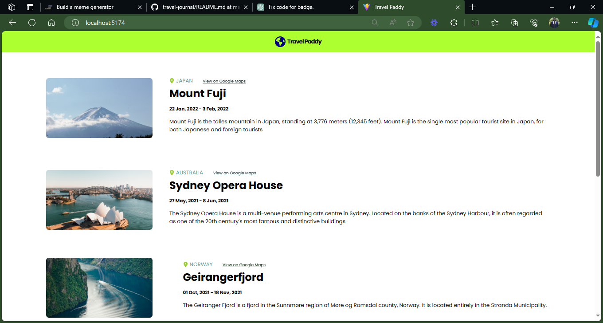

# Scrimba - Travel Journal solution

This is a solution to the [Travel Journal solo project on Scrimba](https://scrimba.com/learn/learnjavascript/). Scrimba helps you improve your coding skills by building realistic projects.

## Table of contents

- [Overview](#overview)
  - [Requirements](#requirements)
  - [Screenshot](#screenshot)
  - [Links](#links)
  - [Getting Started with Create React App](#getting-started-with-create-react-app)
- [My process](#my-process)
  - [Built with](#built-with)
  - [Useful resources](#useful-resources)
- [Author](#author)

## Overview

### Requirements

- Data array in a separate .js file
  - Title, description, price, cover image, rating, review count, location, open spots
- Use .map() and props
- Style & polished
- Mobile designed

### Screenshot

### Links

- Live Site URL: [@Netlify](https://travel-journal-xdelmo.netlify.app/)
- Solution URL: [@GitHub](https://github.com/chuba-cn/travel-paddy)

### Getting Started with Create React App

This project was bootstrapped with [Vite](https://github.com/vitejs/vite).

## My process

### Built with

- Semantic HTML5 markup
- CSS custom properties
- React.JS
- Flexbox

### Useful resources

- [ReactJS](https://reactjs.org/tutorial/tutorial.html) - How to set up a local development environment on your computer
- [FontAwesome](https://fontawesome.com/v5/docs/web/use-with/react) - How to install FontAwesome packages for React -[BobbyHadz](https://bobbyhadz.com/blog/react-assign-object-to-variable-before-exporting-as-module) - Assign object to variable before exporting as module default

## Author

- Github - [Chuba.N.C](https://www.github.com/chuba-cn)
